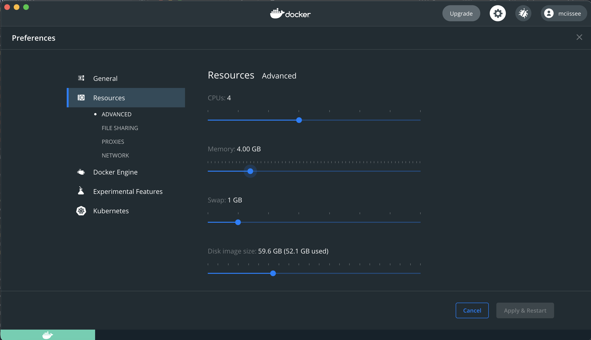
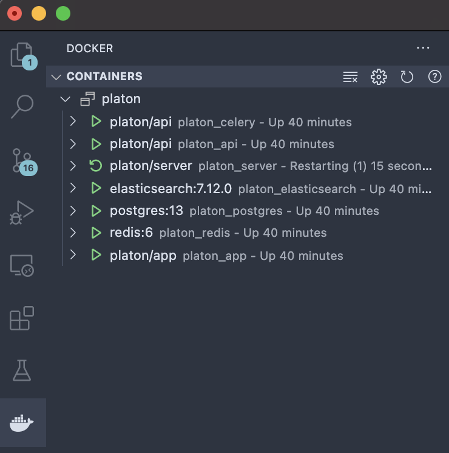
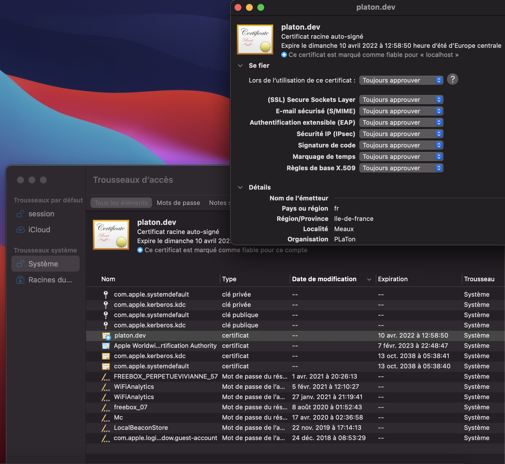
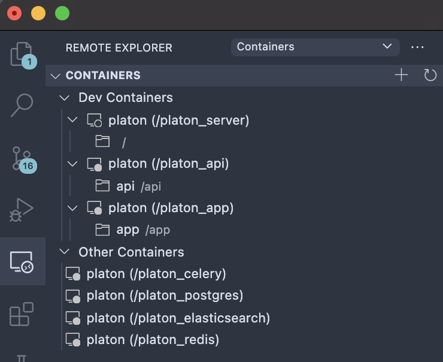

<!-- markdownlint-disable MD033 -->

<h1 align="center"> PLaTon</h1>

<p align="center">

</p>

<p align="center">
Platform for Learning and Teaching online. <br/>
This repository is the entry point to the PLaTon platform for developers, it's the one you should clone to start contributing to PLaTon or to deploy it on your server.</br>
Also please create your issues on this repository and we will transfer them to the right repository.
</p>

<p align="center">
    <a href="https://github.com/PremierLangage/platon/blob/master/LICENSE">
        
    </a>
</p>

## Projects status

[sandbox](https://github.com/PremierLangage/sandbox/)

[](https://github.com/PremierLangage/sandbox/actions/)

[platon-server](https://github.com/PremierLangage/platon-server/)

[](https://github.com/PremierLangage/sandbox/actions/)

[platon-front](https://github.com/PremierLangage/platon-front/)

[](https://github.com/PremierLangage/sandbox/actions/)

## Development

### Prerequisites

In order to run PLaTon you'll need the following tools installed

- [`Docker`](https://www.docker.com)
- [`OpenSSL`](https://www.openssl.org)
- [`ca-certificates`](https://packages.debian.org/fr/sid/ca-certificates) (only on a linux system)
- [`Visual Studio Code`](https://code.visualstudio.com)

### Recommendations

> We recommend you to install the
[Docker](https://marketplace.visualstudio.com/items?itemName=ms-azuretools.vscode-docker) and the [Remote development](https://marketplace.visualstudio.com/items?itemName=ms-vscode-remote.vscode-remote-extensionpack) extensions on vscode. The first one will allow you to use docker inside the editor and the second to use docker as a full-featured development environment.

> You will be asked to install the extensions on the first time you will open the project, but if not you can also display the recommendations by opening the command palette of vscode (`CTRL + P` on Linux and `CMD + P` on Mac) then type the following text


> Also if you are using docker for mac, we recommend you to increase the memory size to 4GB in the resources section of the docker dashboard.



### Installation

Since the platform depends on multiple services like a PostgreSQL database, Elasticsearch, Python, Node, Angular and others projects of the organization... the development process is fully dockerized. All the development (code, run, test, deploy) takes place inside docker containers so you don't have to install anything on your system except [`Docker`](https://www.docker.com) and [`Visual Studio Code`](https://code.visualstudio.com).

You are free to develop on the OS of your choice, it's does not matter thanks to docker, but we recommend you to choose a Linux or an OSX system since the project is fully tested on these two platforms.

1.
    First of all, you should clone this repository on your system using the      following command

    ```sh
    git clone https://github.com/PremierLangage/platon
    ```

2.
    Go to the `platon` directory and execute the `./bin/install.sh` script

    ```sh
    cd platon
    ./bin/install.sh
    ```

    This script will clone the repositories needed to run PLaTon outside of the current directory:

    - [platon-server](https://github.com/PremierLangage/platon-server) -> backend of the platform written with [django](https://www.djangoproject.com).

    - [platon-front](https://github.com/PremierLangage/platon-front) -> frontend of the platform written with [Angular](https://angular.io)

    - [sandbox](https://github.com/PremierLangage/sandbox) -> server to execute code inside of a secured and isolated environment, written with [django](https://www.djangoproject.com).

    After, it will generate some files like

    - `.env` file into the current directory
    - `config.json` file into `../platon-server/platon/config.json`
    - `ssl` certificates into `server/certs`
    - ...

    Please continue reading this guide to learn more about all the generated files and directories.

3.
    Generate docker images of PLaTon services

    ```sh
    ./bin/dev-build.sh
    ```

4.
    Run PLaTon with nginx inside docker and open the browser on `https://platon.dev`

    > This will work because `platon.dev` host is added to the `/etc/hosts/` file of your system by the install script and a `ssl` certificate is generated under the directory `server/certs` to be used by nginx.

    ```sh
    ./bin/dev-up.sh
    ```

    

    At this point, you will see an error in your browser like the following one:

    

    The message and the way you will fix it  might be different depending on the browser.

    - On **Firefox**, you should open the page `about:config` in a new tab and toggle off the `network.stricttransportsecurity.preloadlist` setting then refresh the page, you will now see an option to bypass the warning.
    

    - On *Chrome*, click a blank section of the denial page.
    Using your keyboard, type `thisisunsafe`. This will add the website to a safe list, where you should not be prompted again.
    Strange steps, but it surely works!

    - On **Safari** for mac, you should open the Keychain app, then approve the `platon.dev` certificate.
    

### Scripts

In addition to these 3 scripts, the project contains other scripts placed in the bin folder:

| Script | Description | When to use |
| --- | --- | --- |
| `dev-build.sh` | Install the development environment (by building Docker images). | Before running `dev-up.sh` (don't worry docker will cache the build and rebuild only if a change occurs to the requirements of the frontend of backend) |
| `dev-up.sh` | Execute all development services. |  When you wan't to run PLaTon in development mode |
| `dev-down.sh` | Stop all development services. |  When you wan't to stop the docker containers |
| `install.sh` | Clones the repositories and add some default config files (This script will not clone the repositories if you already have them and it will not override your config files). |  Only once or when you pull a change from this repository. |
| `prod-build.sh` | Install the production environment (by building Docker images). | Same as the `dev-build script` for prod environment.  |
| `prod-up.sh` | Execute all production services.. |  Same as the `dev-up script` for prod environment.  |
| `prod-down.sh` | Stop all development services.. |  Same as the `dev-down script` for prod environment.  |
| `shell-api.sh` | Connect to the backend container. | To run `manage.py` commands for example (the dev or prod services must be started before in order to run this script)?-. |
| `shell-app.sh` | Connect to the frontend project container. | To run `ng` commands to run unitests for example (the dev or prod services must be started before in order to run this script). |
| `shell-postgress.sh` | Connect to the postgres database container. | To run `psql` commands to create a dump for example (the dev or prod services must be started before in order to run this script). |

### Open container inside vscode

Instead of developing directly on your host machine, or using the **shell-*** scripts, we recommend you to run the containers inside vscode. The projects are configured to install some useful vscode extensions.



<https://code.visualstudio.com/docs/remote/attach-container>

When you develop inside of a container, vscode will automatically config git from the config on the host system so please use git directly inside the containers instead of the host machine.

Also, it will recommend you to install some extensions based on the container your'e working on.

## Architecture

TODO

## Backend

TODO

## Frontend

TODO

## Sandbox

TODO

## Deployment

TODO

## Contributing

TODO
